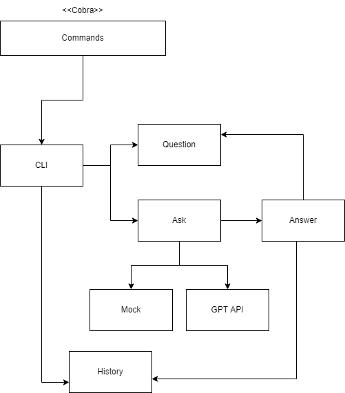
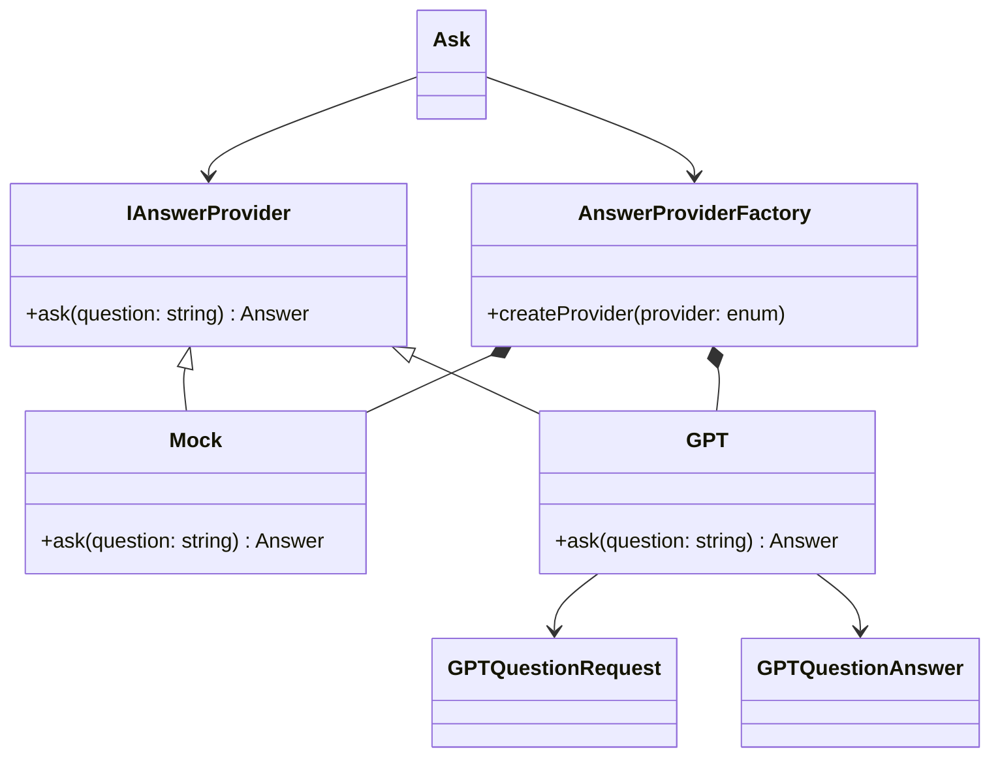
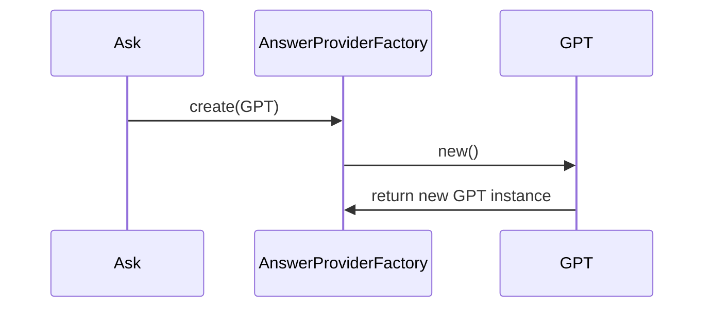
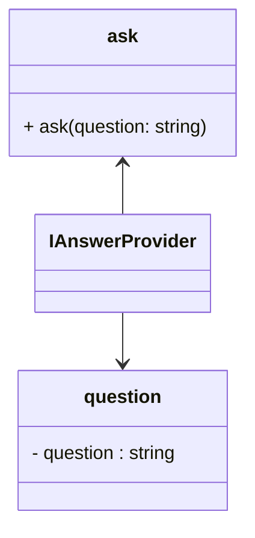
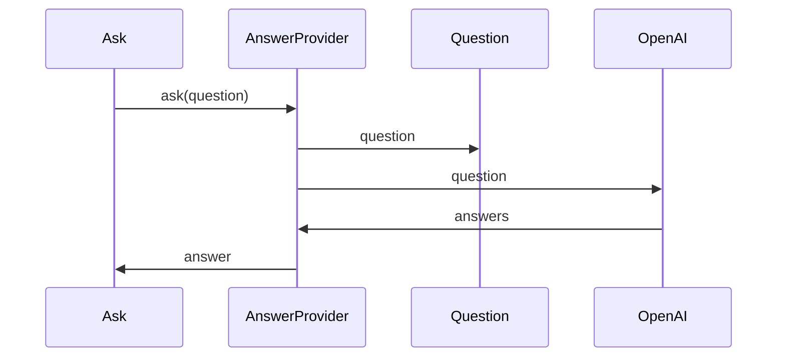
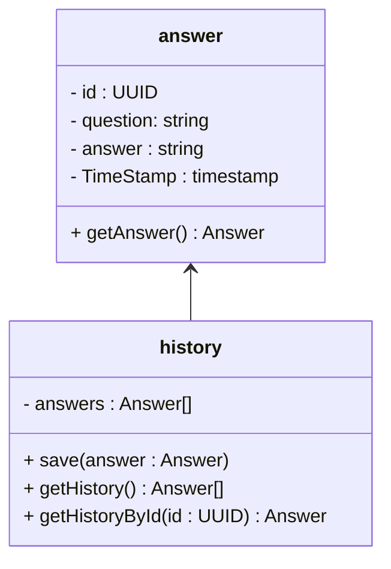
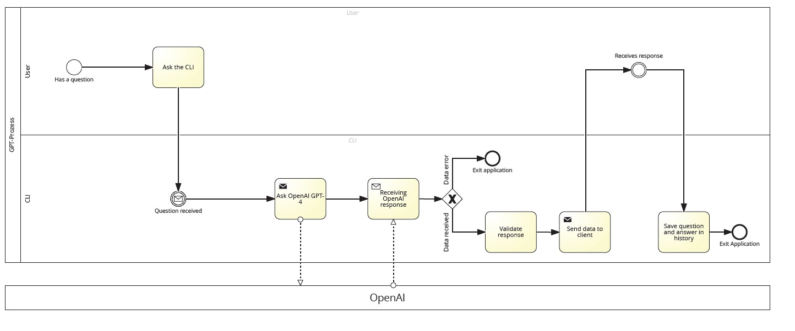

# Documentation

## Requirements

NOTE: The requirements section contains functional and non-functional requirements.

| ID | Requirements | Importance |
| -- | ------------ | ---------- |
| R0 | As Shansai I want to have an easy to use CLI, so that I can ask questions to ChatGPT-4 | High |
| R1 | As a Tester I want to test the CLI-application without connecting to ChatGPT-4 | High |
| R2 | As a Developer I want to add easily new providers for asking questions | High |
| R3 | As Shansai I want to have a history of all the asked questions with the answers | High |
| R4 | As Shansai I want to have an encrypted connection for asking questions, so that no one else can see what I am asking | High |
| R5 | As Gianni I want to have a [SOLID](https://de.wikipedia.org/wiki/Prinzipien_objektorientierten_Designs#SOLID-Prinzipien) compliant software design, so that Shansai can write better software that is more robust, reusable, extensible, readable and maintainable | High |
| R6 | As Gianni I want to have logic sperated from data so that the logic is encapsulated and can be used in different context| High |

## Design

### Package

### CLI package

#### Classes

- main
  - Responsibility: Starting point of the application
- cli
  - Responsibility: Manages all the CLI commands

### Ask package

- Responsibility: Manages the question asking with 3rd party providers
- Dependency-Inversion-Principle: Introduced IAnswerProvider as an interface class, so that the implementations of the interface a decoupled from the consumer (class ask)

#### Create GPT provider

### Answer package

#### Classes

- answer
  - Responsibility: Fetches the answer and provides it
- question
  - Responsibility: Contains the question
- ask
  - Responsibility: Asks GPT-4 or a Mock the user-entered question

### History package

#### Classes

- answer
  - Responsibility: Receives the answer of GPT-4
- history
  - Responsibility: Saves questions and answers in a csv

### Process

